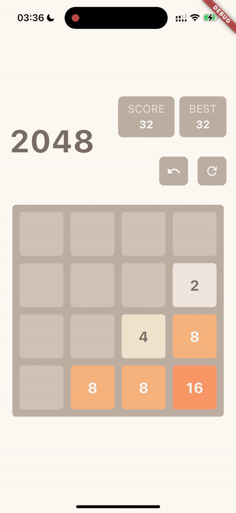

# Twenty Forty Eight



Popular mobile game '2048', moving tiles and trying to merge the tiles with same values and get highest score before grid gets full.
Learned about Flutter Animations and BLoC state management.

## Features

- Game start with a 4x4 grid and 3-4 tiles randomly placed
- Tiles valued at either 2 or 4
- Players swipe the tiles in any of the four directions, and they move as far as possible in that direction
- Tiles with the same value merge into one tile with twice the value when they collide
- Score updated when tiles are merged
- A new tile appear randomly on the board after each move
- Animations used to smoothly move and merge the tiles
- Game stop when no legal moves are possible and it allow the user to restart 
- Game include a functionality to track and display the current and best scores
- Game include a functionality to undo previous move.

## Run Locally

### Prerequisites

Ensure you have the following installed on your local machine:

- Xcode (iOS) or Android Studio (Android)
- [Flutter Version Manager](https://fvm.app/documentation/getting-started)


### Clone the repository

First, navigate to the directory where you want to store the project and clone the repository:

```bash
git clone git@github.com:cenk-idris/game_2048.git
cd game_2048
```

### Sets correct Flutter SDK version for the project (it sets SDK only for this project so it wont mess your global config no worries)
```bash
fvm use
```

### Open iOS Simulator, hope you have mac :)
```bash
open -a Simulator
```

### Run the application
```bash
flutter run
```

### Try in case of error , might help :)
```bash
  flutter doctor -v
```
